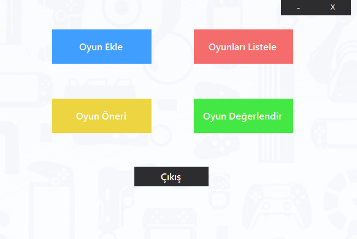
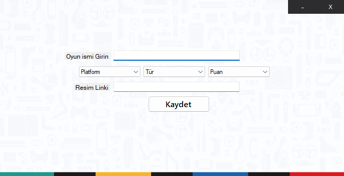
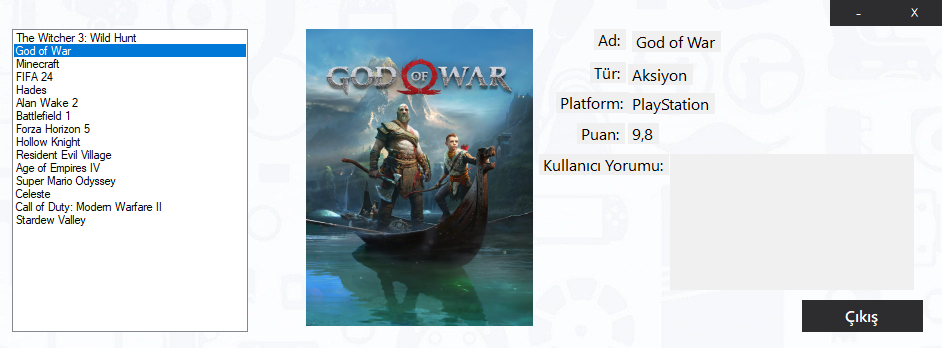
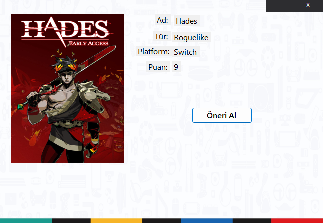
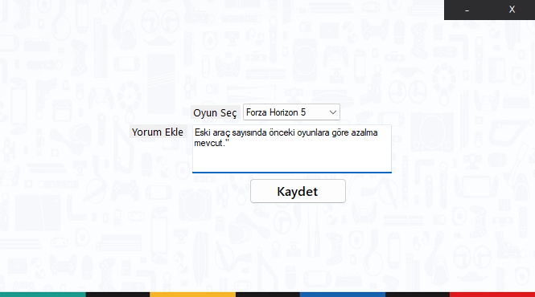

# 🎮 Oyun Öneri ve Değerlendirme Uygulaması

Bu masaüstü uygulaması, kullanıcıların oyunları listeleyebileceği, değerlendirebileceği ve yorum ekleyebileceği bir sistem sunar. Aynı zamanda oyun önerisi özelliği ile kullanıcıya rastgele yüksek puanlı oyunlar önerilir.

## 🚀 Özellikler

- ➕ Oyun ekleme (isim, tür, platform, puan, resim linki ile)
- 📃 Oyun listeleme ve detay görüntüleme
- 🗣️ Kullanıcı yorumu ekleyerek oyun değerlendirme
- 🎲 Rastgele yüksek puanlı oyun önerisi
- 🖥️ Modern, sade ve kullanıcı dostu arayüz

## 🛠️ Kullanılan Teknolojiler

- 💻 C# (Windows Forms)
- 🗄️ SQL Server (Veritabanı)
- 📦 MSSQL `.bak` dosyasından restore işlemi
- 🔌 ADO.NET (Veritabanı bağlantısı)

## ⚙️ Kurulum

### 1. Veritabanını Yükleme
📁 Proje klasörü içinde yer alan `VideoOyun.bak` dosyasını kendi SQL Server'ınıza geri yükleyin.

🧭 SQL Server Management Studio (SSMS) kullanarak:
- `Veritabanları` > `Geri Yükle` > `Cihaz` seçeneği ile `.bak` dosyasını seçin.
- Geri yükleme tamamlandığında veritabanınız `VideoOyun` ismiyle oluşturulacaktır.

### 2. Veritabanı Bağlantısını Ayarlama
🔧 `DatabaseHelper.cs` dosyasını açın.

Aşağıdaki örnek bağlantı cümlesinde yer alan `YOUR_SERVER_NAME` kısmını kendi SQL Server adınız ile değiştirin:

```csharp
string connectionString = "Server=YOUR_SERVER_NAME;Database=VideoOyun;Trusted_Connection=True;";
```

### 3. Projeyi Çalıştırma
✅ Visual Studio üzerinden projeyi açın ve derleyin.

🎮 Ana menüden gerekli işlemleri yapabilirsiniz: Oyun ekle, listele, öneri al, değerlendirme yap vb.

## 🖼️ Ekran Görüntüleri

Aşağıda uygulamaya ait 5 ekran görüntüsü yer almaktadır:

### 🏠 Ana Sayfa


### ➕ Oyun Ekleme Ekranı


### 📃 Oyunları Listeleme


### 🎲 Oyun Önerisi


### 🗣️ Oyun Değerlendirme


---

